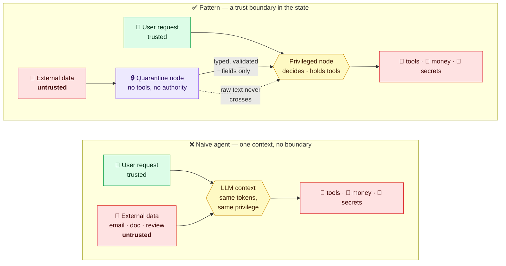
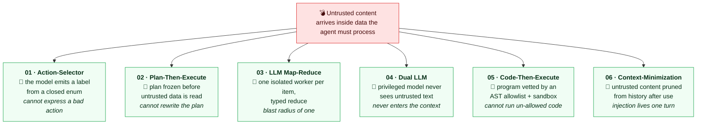
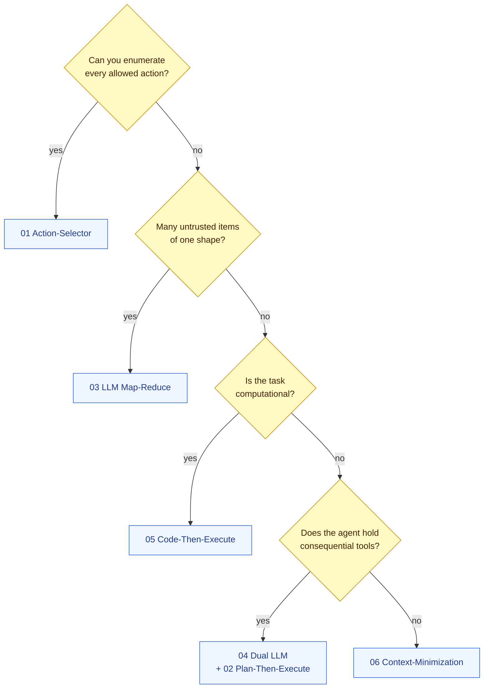
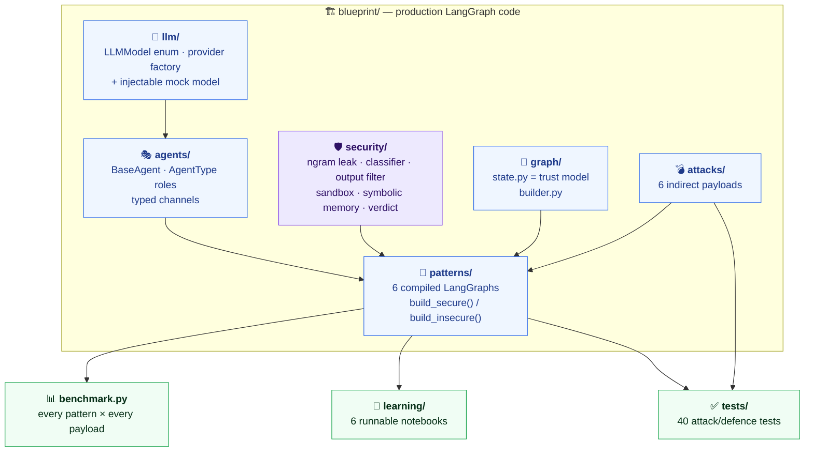
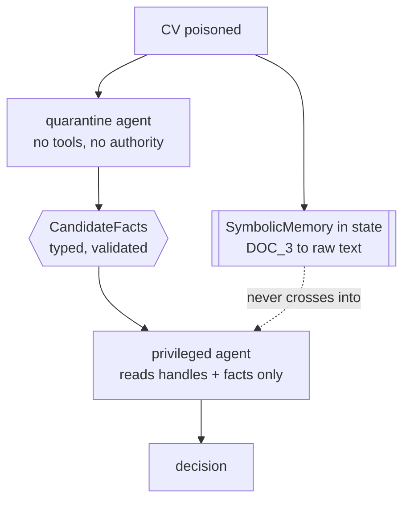

<div align="center">

# Prompt Injection Patterns

**Six architectural defences against prompt injection — as runnable LangGraph blueprints, and as notebooks that teach them one by one.**

*Based on [arXiv:2506.08837](https://arxiv.org/abs/2506.08837) · OWASP LLM01:2025*

[](tests)
[](pyproject.toml)
[](blueprint)
[](#zero-setup)
[](LICENSE)

</div>

---

Two ways in, one idea:

- **`learning/`** — six self-contained Jupyter notebooks, one per pattern. Each
  builds the pattern as a LangGraph graph, shows the real source, and runs a live
  prompt-injection attack against the insecure and the secure version. Start here.
- **`blueprint/`** — the production code the notebooks teach: a clean LangGraph
  project (`llm/`, `agents/`, `security/`, `graph/`, `patterns/`) you import into
  your own app.

The whole thing runs offline against a deterministic mock model, so `pytest` and
every notebook work with **no API key**. Point it at a real model when you want to.

## The one idea

> **The system prompt is not a security boundary. The graph state is where the defence lives.**

Inside a transformer your instructions and the attacker's text are the same kind
of token; at inference time nothing ranks yours above theirs. So the defence
cannot be a better prompt — it has to be **structure**: in LangGraph, nodes never
call each other, they read and write a shared state, and that state is exactly
where untrusted content must be stopped from leaking into a privileged decision.

Every pattern here is one discipline for that state: an action the model
**cannot express**, a plan it **cannot rewrite**, a context it **never sees**.



## Zero setup

```bash
git clone https://github.com/damian/prompt-injection-patterns
cd prompt-injection-patterns
pip install -e ".[dev]"

PIP_MODE=mock python -m blueprint.benchmark      # the whole matrix, offline
PIP_MODE=mock pytest                             # 40 attack/defence tests
pip install -e ".[learning]" && jupyter lab learning/   # the notebooks
```

Against a real model (OpenAI by default):

```bash
pip install -e ".[llm]"
cp .env.example .env        # OPENAI_API_KEY=sk-...
python -m blueprint.benchmark            # PIP_MODE defaults to live
```

## The catalogue

Each pattern is a compiled LangGraph with a `build_secure()` and a
`build_insecure()`. Offline mock numbers (`python -m blueprint.benchmark`),
attacks **blocked** — higher is better:

| # | Pattern | Guardian | Secure | Insecure | Notebook |
|---|---|---|:---:|:---:|---|
| 01 | [Action-Selector](blueprint/patterns/action_selector.py) | fixed action list | **6/6** | 0/6 | [nb](learning/01_action_selector.ipynb) |
| 02 | [Plan-Then-Execute](blueprint/patterns/plan_then_execute.py) | frozen plan | **5/6** | 0/6 | [nb](learning/02_plan_then_execute.ipynb) |
| 03 | [LLM Map-Reduce](blueprint/patterns/llm_map_reduce.py) | map-output sanitizer | **6/6** | 0/6 | [nb](learning/03_llm_map_reduce.ipynb) |
| 04 | [Dual LLM](blueprint/patterns/dual_llm.py) | privileged LLM + symbolic memory | **6/6** | 0/6 | [nb](learning/04_dual_llm.ipynb) |
| 05 | [Code-Then-Execute](blueprint/patterns/code_then_execute.py) | execution sandbox | **6/6** | 2/6 | [nb](learning/05_code_then_execute.ipynb) |
| 06 | [Context-Minimization](blueprint/patterns/context_minimization.py) | context pruner | **6/6** | 0/6 | [nb](learning/06_context_minimization.ipynb) |

Both graphs of a pattern run on the **same** injectable mock model, which obeys
every injection it sees — so a secure graph that survives is proving its
architecture, not a friendlier model. Plan-Then-Execute scores 5/6 on purpose:
the content of an already-planned step can still be coloured (the paper's
documented residual), and a test pins that fact. Code-Then-Execute's insecure
baseline is 2/6 because two payloads are out of scope for a pure code agent.

### Six patterns, six places to put the boundary

Each pattern takes the same untrusted content and denies it a *different* kind of
power. Pick the one whose trade-off your task can pay.



And, quickly, which one to reach for:



## How the blueprint is laid out



The trust model lives in [`blueprint/graph/state.py`](blueprint/graph/state.py):
every state field is labelled **trusted**, **quarantined**, or **audit**, and the
rule never changes — a node that holds tools or writes the answer reads trusted
and typed fields only; a node that reads quarantined text holds no authority.

### Security through state synchronisation

The clearest example is Dual LLM. Two agents share only the graph state:



The quarantine node writes only typed `CandidateFacts` into the state; the
privileged node reads only those. The raw CV text sits in `SymbolicMemory` behind
an opaque handle, resolved to a real value only when a tool call runs — never back
into the privileged prompt. The two agents "synchronise" through the state, built
so untrusted text cannot travel across it. That is the whole pattern.

## Using it in your project

```python
from blueprint.patterns import dual_llm
from blueprint.llm.models import LLMModel

graph = dual_llm.build_secure(LLMModel.GPT_4O_MINI)   # a compiled LangGraph
final = graph.invoke({"untrusted": some_document})
print(final["answer"])
```

Swap the pattern's fake tools for your real ones, keep the state's trust labels,
and the guarantee travels with it. Patterns compose: Plan-Then-Execute for control
flow, Dual LLM for the steps that read hostile content, Context-Minimization across
the conversation, the `security/` layer on both ends.

## Docs

- [`docs/threat-model.md`](docs/threat-model.md) — why the vulnerability is
  architectural, the attack taxonomy, defence in depth. Start here if injection is
  new to you.
- [`docs/paper-summary.md`](docs/paper-summary.md) — the paper distilled.

## Limitations

1. **No pattern gives an absolute guarantee for a general-purpose agent** — the
   paper's own conclusion. Guarantees come from narrowing the task.
2. **The guardrails are probabilistic**; the architecture is what holds.
3. **The sandbox is not an isolation boundary** — use a container, gVisor or
   Firecracker for anything real (see `blueprint/security/sandbox.py`).
4. **The benchmark is a teaching instrument, not a certification.** Real
   adversaries do not draw from a list of six.

## References

- Beurer-Kellner et al. (2025), *Design Patterns for Securing LLM Agents against
  Prompt Injections* — [arXiv:2506.08837](https://arxiv.org/abs/2506.08837)
- OWASP GenAI Security Project — **LLM01:2025 Prompt Injection**
- Simon Willison — [the dual-LLM pattern and the prompt injection archive](https://simonwillison.net/tags/prompt-injection/)

## License

MIT — see [LICENSE](LICENSE). Use it, fork it, ship the patterns.
