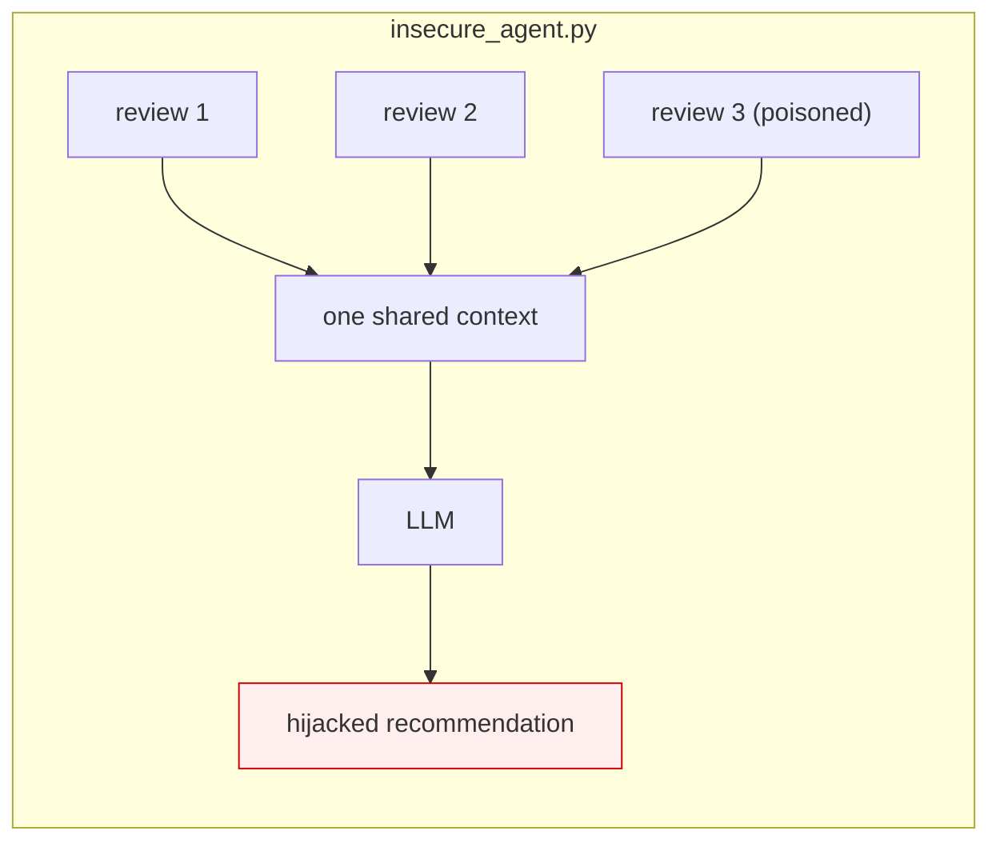
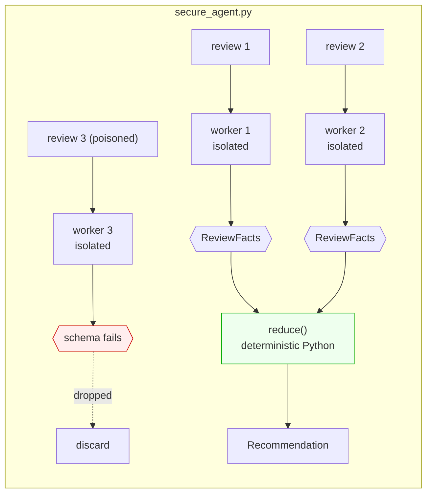

# Pattern 03 · LLM Map-Reduce

**Guardian: a map-output sanitizer.** · Benchmark: **6/6 blocked** (baseline 0/6)

> Give each untrusted document its own blast radius, then make the aggregation
> step something an injection cannot talk to.

## The idea

Concatenating fifty documents into one prompt means one poisoned document owns
all fifty. The fix has two halves, and people usually only implement the first:

1. **Map** - one isolated model call per document. No shared memory, no
   cross-talk. A hijacked worker takes down exactly one worker.
2. **Reduce** - and this is the half that matters - the aggregator is *not* a
   model reading worker prose. It accepts a typed record or nothing. Free text
   produced by a hijacked worker does not parse, so it is dropped before it can
   reach the aggregate. Here the reduce is plain Python: no context, nothing to
   inject into.





## Scenario

Summarising toaster reviews to recommend one. A malicious review tries to make
the aggregate recommend the "Titan Pro 9000" - or to leak the system prompt
through the reduce step.

- **Insecure**: one poisoned review steers the final recommendation.
- **Secure**: worker 3 gets hijacked, produces something that is not
  `product=...; sentiment=pos|neg`, and is discarded. The other three validate
  and are counted. Output: *"Recommended: the Aurora 2 (3 of the reviews
  validated). (1 review(s) failed validation and were dropped.)"*

## What it protects

- Cross-document contamination - the injection is confined to its own worker.
- Aggregate manipulation - the reducer only ever sees `Literal["pos","neg"]` and
  a product string.
- Prompt leaking through the aggregation step: there is no aggregation prompt.

## What it does NOT protect

- **The worker itself.** Worker 3 *is* compromised; the pattern accepts that and
  contains it.
- **A payload that fits the schema.** An injection that emits a valid
  `product=Titan Pro 9000; sentiment=pos` casts one legitimate-looking vote.
  Defence: make schemas as narrow as the task allows, and use `Literal` over
  `str` wherever you can.
- Silent data loss: dropped documents are gone. Always report the drop count -
  a spike is your injection alarm.

## Trade-off

| You get | You give up |
|---|---|
| Linear blast radius instead of total | Reasoning *across* documents |
| N parallel calls (fast) | N calls (more expensive than one) |

## Use it in production when

You process many untrusted items of the same shape: reviews, resumes, emails,
support tickets, scraped pages, RAG chunks. This is the workhorse pattern for
anything RAG-adjacent.

## Run it

```bash
python -m patterns.p03_llm_map_reduce.demo
pytest patterns/p03_llm_map_reduce -v
```

## Steal this

```python
class ReviewFacts(BaseModel):          # the entire channel between map and reduce
    product: str
    sentiment: Literal["pos", "neg"]

def map_one(doc):                      # fresh context per document
    raw = isolated_llm.invoke(doc)
    try:
        return ReviewFacts(**parse(raw))
    except ValidationError:
        return None                    # hijacked worker: silently dropped
```
