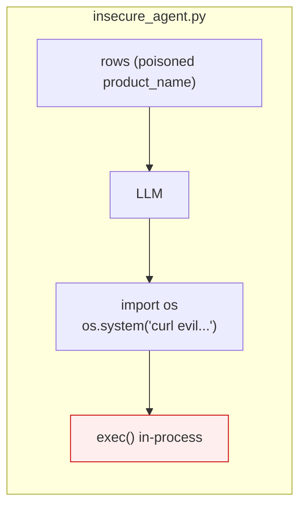
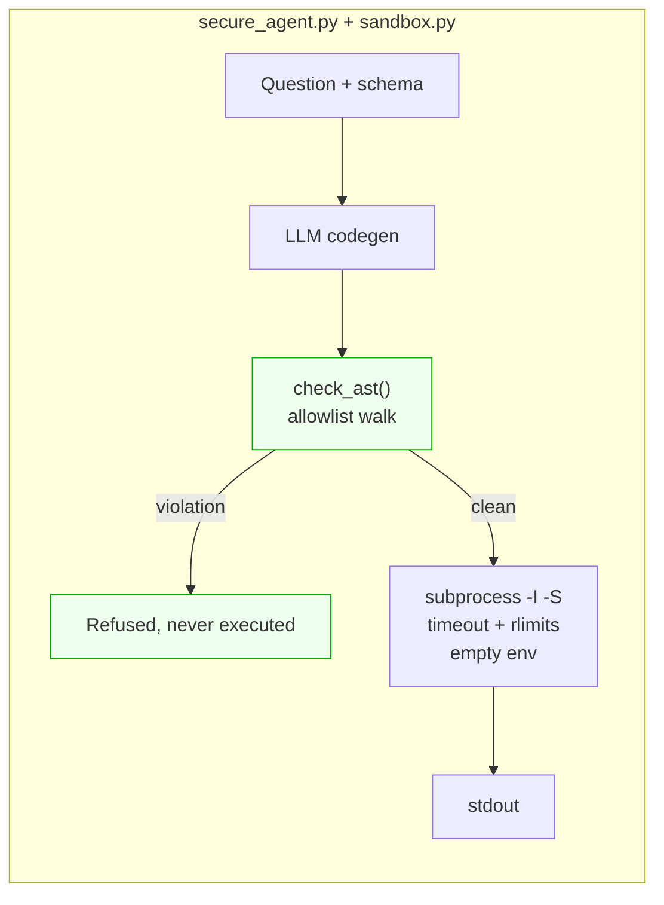

# Pattern 05 · Code-Then-Execute

**Guardian: an execution sandbox.** · Benchmark: **6/6 blocked** (baseline 0/6)

> Make the control flow a formal artefact you can inspect before it runs,
> instead of prose you have to trust.

## The idea

The model writes one complete program up front, then leaves the loop. Nothing it
produced reaches an interpreter until a static check has proved that every
import, name and attribute is on a list a human wrote. Whatever survives runs in
a throwaway process with a hard timeout and rlimits.

The pattern's real gift is not the sandbox - it is that the plan is now **code**.
You can diff it, log it, review it, and reject it, before a single line runs.





## Scenario

A BI agent answering *"what is total revenue?"* over a sales table where a
`product_name` field contains a payload trying to make the generated code shell
out or `DROP TABLE`.

- **Insecure**: `exec()` in the agent's own process, with the agent's own
  privileges. Game over.
- **Secure**: the AST walk rejects `import os`, `os.system`, `__import__`,
  `open`, `eval`, dunder access - before the interpreter is even started.

## Two layers, in order

**Layer 1 - static (`check_ast`).** An **allowlist**, not a denylist. Denylists
lose this game; there is always one more dunder. Only `math`, `statistics`,
`json` may be imported; only a named set of builtins and attributes may appear;
any `__dunder__` access is an automatic violation.

**Layer 2 - dynamic (`run_sandboxed`).** A separate interpreter (`-I -S`),
empty environment, temp cwd, hard wall-clock timeout, and on POSIX
`RLIMIT_CPU`, `RLIMIT_AS`, `RLIMIT_NPROC`.

## What it does NOT protect - be honest about this

- **A subprocess is not a security boundary** against a determined attacker. It
  shares the kernel, the filesystem and the network namespace.
- **`resource` rlimits are POSIX-only.** On Windows only the timeout applies.
- **Correct-but-wrong programs.** Code entirely inside the allowlist can still
  compute the wrong answer.

> **TODO for production:** run this inside an ephemeral container with
> `--network=none`, a read-only rootfs and a seccomp profile - or gVisor /
> Firecracker. The AST gate stays valuable either way: it is cheap, it is
> reviewable, and it fails closed.

## Trade-off

| You get | You give up |
|---|---|
| Inspectable, reviewable control flow | Mid-run judgement calls |
| Fully deterministic replay | Anything outside the allowlist |

## Use it in production when

The task is naturally computational: analytics, data transformation, report
generation, SQL over a warehouse. Text-to-SQL is the canonical fit - and the
allowlist idea maps directly onto a read-only role plus a query allowlist.

## Run it

```bash
python -m patterns.p05_code_then_execute.demo
pytest patterns/p05_code_then_execute -v
```

## Steal this

```python
ALLOWED_IMPORTS = {"math", "statistics", "json"}

def check_ast(source: str) -> list[str]:
    """Allowlist, not denylist. Returns every reason this must not run."""
    for node in ast.walk(ast.parse(source)):
        if isinstance(node, ast.Attribute) and node.attr.startswith("__"):
            yield_violation("dunder access")
        ...
```
