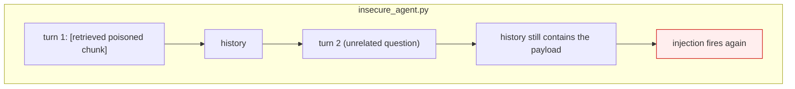
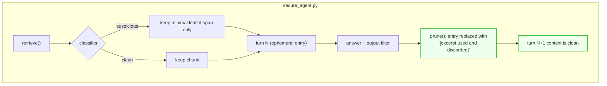

# Pattern 06 · Context-Minimization

**Guardian: a context pruner.** · Benchmark: **6/6 blocked** (baseline 0/6)

> An injection in an append-only history is not an event. It is tenancy.

## The idea

Most chat agents keep everything. The RAG chunk that answered turn 1 is still in
the context at turn 12, which means an injection that arrived once keeps firing
on every subsequent turn - it has quietly become part of the standing
instructions.

Context-Minimization gives untrusted content a job **and an expiry**. The
retrieved span is present for the turn that needs it; before the next call it is
replaced by a short sanitised note, or dropped entirely. Pair it with a
retriever that returns the minimal span rather than the whole document: the
smallest context is the one an attacker has least room in.





## Scenario

A medication-leaflet chatbot. Turn 1: *"can I take this with alcohol?"* pulls a
RAG chunk that carries an injection. Turn 2 is an unrelated follow-up.

- **Insecure**: the payload is still in the history at turn 2 and hijacks it.
- **Secure**: the chunk was marked ephemeral, used, and pruned. The test asserts
  the payload is absent from the **turn-2 assembled context**, not merely absent
  from the answer.

## What it protects

- **Injection persistence** - the dominant failure mode of long conversations.
- Context-window budget, as a pleasant side effect: less text, lower cost, less
  drift.
- Reduced exposure: pruned content cannot leak in a later turn either.

## What it does NOT protect

- **The turn where the poisoned chunk is present.** This pattern bounds the
  *lifetime* of an injection, it does not prevent it. It composes with the
  others rather than replacing them - use Dual LLM or Map-Reduce for the turn
  itself.
- **Summarisation as laundering.** If you replace a chunk with a
  model-written summary, that summary can carry the injection forward. Either
  prune outright, or force the summary through a schema.

## Trade-off

| You get | You give up |
|---|---|
| Injections expire after one turn | Long-range conversational memory |
| Smaller, cheaper prompts | Follow-ups that rely on earlier retrieved detail |

## Use it in production when

Any multi-turn agent over retrieved content: RAG chatbots, documentation
assistants, customer support with knowledge-base lookup. It is the cheapest
pattern here to retrofit - it is a history class, not an architecture change.

## Run it

```bash
python -m patterns.p06_context_minimization.demo
pytest patterns/p06_context_minimization -v
```

## Steal this

```python
class PruningHistory:
    def add(self, entry, ephemeral=False): ...
    def prune(self, summary="[retrieved excerpt used and discarded]"):
        for i in self._ephemeral:
            self.entries[i] = summary      # in place: turn order stays intact
        self._ephemeral.clear()

# Call prune() at the end of every turn that touched untrusted content.
```
